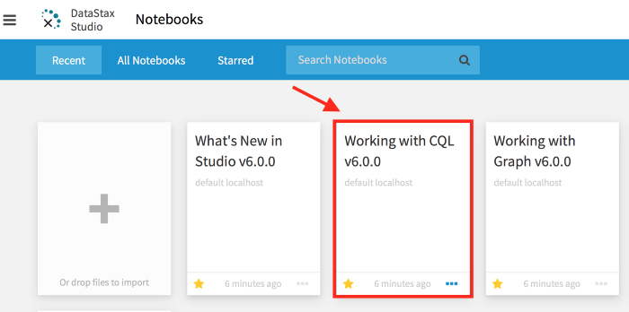
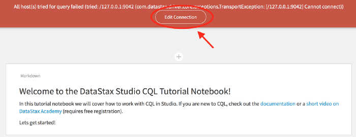
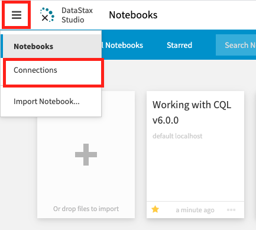
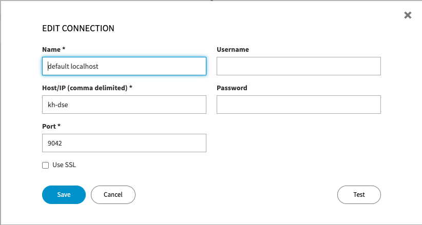

# Getting Started with Cassandra on Docker

We will be using the datastax images throughout this example. The DataStax Server Image is the DataStax distribution of Apache Cassandra with additional capabilities of Search Engine, Spark Analytics and Graph Components (configurable at the docker run step). For quality and simplicity, this is your best bet.

## Installation

Pull the docker image

`docker pull datastax/dse-server:6.7.11`

Pull DataStax Studio Image (Notebook). The DataStax Studio is a notebook based development tool for data exploration, data modeling, data visualization, and query profiling. Studio also has the ability to save, import and export notebooks. This allows you to share your findings with your team as you go.

`docker pull datastax/dse-studio`

## Running the containers

We will execute the docker run command to create new containers from pulled images.

`docker run -e DS_LICENSE=accept --memory 4g --name kh-dse -d datastax/dse-server -g -s -k`

The `-name` parameter provides a human readable reference for the container operations, but can also be used as a resolvable `hostname` for communication between containers (required for later steps). As stated before, the DataStax distribution comes with some additonal integrations for building different models, making it highly sought after for implementing domain driven design patterns.

- The `-g` flag starts a Node with Graph Model enabled
- The `-s` flag starts a Node with Search Engine enabled
- The `-k` flag starts a Node with Spark Analytics enabled

### Starting the Studio Container

`docker run -e DS_LICENSE=accept --link kh-dse -p 9091:9091 --memory 1g --name kh-studio -d datastax/dse-studio`

The -link parameter provides a way to map a hostname to a container IP address. In this example, we map the database container to Studio container by providing its name, `kh-dse`. Now Studio can connect to the database using the container name instead of an IP address. (can also do user-defined bridge) The -p flag is for mapping ports between container and host. The 9091 port is the default address for Studio.

### Working with Cassandra in the Studio

Visit the Studio page that is now hosted on your docker container by entering [http://localhost:9091](http://localhost:9091) in your browser. Select the “Working with CQL” notebook.

>When opening the notebook you will see a connection exception. This is because the default connection in studio uses localhost. You will need to change localhost to the DataStax Server Container name ‘kh-dse’.

Click on the Hamburger icon and select Connections menu item

Select the “Edit" menu option for the default `localhost connection` to modify the Host/IP connection field from localhost to the DSE Server Container‘s name, `kh-dse`. Finish by performing a Test. If successful, save the new connection settings.

Reopen the Welcome guide for CQL Notebook, you can now play with the wlecome tutorial to get a hang of how CQL works.
